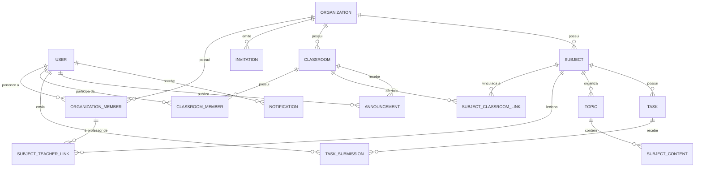

# Brief de Produto/Domínio — LMS Nexus

> **Propósito deste documento:** descrever o que o sistema **é** e **faz**, com base na implementação real do backend e nas decisões de produto já fechadas — para servir de contexto a um redesenho completo do front-end (UI/UX) a partir do zero. Este documento **não** descreve nem critica a implementação visual atual do front-end (isso está em `FRONTEND_DESIGN_AUDIT.md`, com outro propósito e outra audiência). Toda regra de negócio aqui citada foi confirmada no código-fonte do backend (`apps/api/src/main/java/br/edu/lms/module/**`), nas migrations Flyway, no `API_CONTRACT.md` e nos documentos de requisitos/decisões do projeto.

---

## 1. O que é o sistema

**LMS Nexus** é uma plataforma de gestão de aprendizagem (LMS — *Learning Management System*) **multi-tenant**, inspirada no Google Classroom, voltada para instituições de ensino que precisam organizar **turmas**, **disciplinas**, **conteúdo didático** e **avaliações** dentro de **Organizações** educacionais isoladas entre si. O produto nasceu como Trabalho de Conclusão de Curso (TCC), mas sua arquitetura (Monolito Modular com Bounded Contexts, Domain Events, Ports & Adapters) foi deliberadamente projetada para evoluir — os módulos de gamificação e correção por IA já têm lugar reservado na arquitetura, mesmo não estando implementados no MVP.

O valor central do produto é reduzir o atrito operacional de uma instituição de ensino (ou de um grupo de professores independentes) para: (1) organizar turmas e disciplinas, (2) publicar e distribuir conteúdo, (3) aplicar e corrigir tarefas/avaliações, (4) comunicar-se com os alunos via mural e notificações, e (5) enxergar, via dashboards, a saúde pedagógica de turmas e disciplinas (quem está entregando, quem está atrasado, quais as médias). Não existe hierarquia pré-existente no sistema: tudo nasce do cadastro de um usuário, que then cria uma Organização e, a partir dela, convida pessoas e monta a estrutura de turmas e disciplinas. Um mesmo usuário pode pertencer a **múltiplas organizações simultaneamente**, com papéis potencialmente diferentes em cada uma, e pode alternar entre elas (endpoint `POST /auth/switch-organization`) sem precisar de contas separadas.

---

## 2. Personas e papéis

O RBAC do sistema é definido por um único enum de papéis por organização (`MemberRole`: `ADMIN_ORG`, `GESTOR`, `PROFESSOR`, `ALUNO`), extraído do claim `groups`/`roles` do JWT — nunca inferido do corpo da requisição. Dentro de uma turma existe ainda um segundo nível de papel, mais restrito (`ClassroomMemberRole`: apenas `PROFESSOR` e `ALUNO` — ADMIN_ORG e GESTOR não viram "membros" de turma, eles administram por herança do papel organizacional).

### ADMIN_ORG — Administrador da Organização
- Criado **automaticamente** para quem cria a Organização (`POST /organizations`); não é um papel atribuível por convite a si mesmo.
- Não pode ser removido do papel de ADMIN_ORG-criador por ninguém (`RN-03`) — é uma garantia estrutural, não apenas uma regra de UI.
- Gerencia tudo dentro da organização: convida membros com qualquer papel (GESTOR, PROFESSOR, ALUNO), remove membros (soft delete, exceto a si mesmo), cria/edita/exclui turmas e disciplinas, atribui professores a disciplinas, vê o dashboard consolidado da organização inteira e exporta relatórios em PDF.
- É o único papel com acesso a `GET /organizations/{id}/dashboard` e `GET /organizations/{id}/reports/pdf`.
- Um mesmo usuário pode ser ADMIN_ORG de várias organizações distintas.

### GESTOR — Gestor de turmas
- Convidado por um ADMIN_ORG via e-mail com papel definido no convite.
- Escopo de atuação é o de **turmas específicas**, não a organização inteira: cria, edita e exclui (soft delete) turmas, vincula/desvincula membros de turma, gera/regenera código de convite de turma.
- Tem seu próprio dashboard (`GET /organizations/{id}/gestor-dashboard`, e não `/classrooms/{id}/dashboard` como versões antigas da documentação sugeriam) com foco em saúde das turmas sob sua gestão: taxa de entrega, média de notas, comparação entre turmas, alunos com mais pendências/atrasos. Também pode exportar esse painel em PDF.
- Não gerencia membros da organização como um todo (não convida/remove membros da org) — isso é exclusivo do ADMIN_ORG.

### PROFESSOR — Professor
- Convidado pelo ADMIN_ORG (papel definido no convite).
- Pode lecionar **múltiplas disciplinas** dentro da mesma organização, e uma disciplina pode ter múltiplos professores atribuídos.
- Cria e gerencia conteúdo complementar (vídeos, documentos, links, arquivos) organizado em tópicos dentro de suas disciplinas; reordena tópicos e conteúdos.
- Cria tarefas (rascunho ou publicadas), define prazo e pontuação máxima, anexa materiais de apoio.
- Avalia submissões dos alunos: atribui nota (se a tarefa tiver pontuação máxima definida) e feedback textual; pode registrar ausência/zero manualmente para quem não entregou.
- Publica avisos no mural da turma; só pode editar/excluir os **próprios** avisos (`isAuthoredBy`).
- Tem seu próprio dashboard, escopado por **disciplina** (`GET /subjects/{id}/dashboard`): submissões pendentes de avaliação (badge), distribuição de notas da última tarefa, alunos sem entrega, média por aluno.
- Não cria turmas nem disciplinas (isso é ADMIN_ORG/GESTOR), mas gerencia o conteúdo dentro delas.

### ALUNO — Estudante
- Ingressa em turmas de duas formas: convite por e-mail (como qualquer outro papel) OU, de forma exclusiva a este papel, via **link/código público de 6 caracteres** sem necessidade de convite individual — essa é a via de ingresso mais comum e mais rápida.
- Consome conteúdo complementar das disciplinas de suas turmas, visualiza tarefas publicadas e envia submissões (texto e/ou arquivos) até o prazo.
- Vê apenas os próprios dados: notas, feedbacks, dashboards — nunca dados de outros alunos.
- Vê apenas turmas/disciplinas/tarefas das organizações e turmas às quais pertence (`RN-07`) — isolamento reforçado tanto por RBAC quanto por filtros de `organization_id`/associação em toda consulta.
- Não pode publicar avisos, apenas visualizá-los.
- Tem dashboard próprio (`GET /students/me/dashboard`): próximas tarefas ordenadas por urgência de prazo, tarefas entregues vs. pendentes, últimas notas/feedbacks, média geral por disciplina.

### Observação estrutural importante para o design
Um mesmo indivíduo pode ter **papéis diferentes em organizações diferentes** (ex.: ADMIN_ORG na sua própria escola e ALUNO num curso de terceiros) — a UI de troca de organização/contexto (`switch-organization`) precisa ser um conceito de primeira classe, não um detalhe secundário de configurações.

---

## 3. Modelo de domínio

### Entidades centrais e atributos principais

- **User** — `fullName`, `email` (único, global — tabela `users` não é multi-tenant), `passwordHash`, `status` (`PENDING_CONFIRMATION | ACTIVE | SUSPENDED`). Um usuário existe uma única vez no sistema e se relaciona com N organizações via `organization_members`.
- **Organization** — `name`, `description`, `ownerId` (dono único, distinto — mas geralmente coincidente — do vínculo ADMIN_ORG em `organization_members`). Fronteira de isolamento multi-tenant de todo o sistema.
- **OrganizationMember** — vínculo N:M entre `User` e `Organization` com `role` (`ADMIN_ORG | GESTOR | PROFESSOR | ALUNO`). É aqui, e não na tabela `users`, que o papel vive.
- **Invitation** — `email`, `role` convidado, `token` (uso único), `status` (`PENDING | USED | EXPIRED`), `invitedBy`, `expiresAt` (7 dias).
- **Classroom** (Turma) — `name`, `description`, `academicPeriod`, `status` (`ACTIVE | ARCHIVED`), `inviteCode` (6 caracteres alfanuméricos, regenerável), pertence a uma `Organization`.
- **ClassroomMember** — vínculo N:M entre `User` e `Classroom` com `role` restrito a `PROFESSOR | ALUNO`.
- **Subject** (Disciplina) — `name`, `code` (sigla, ex. MAT101), `description`, `workloadHours`, pertence a uma `Organization`. Vincula-se a N turmas (`subject_classrooms`) e N professores (`subject_teachers`, que referencia `organization_members`, não `users` diretamente — só pode ser professor de disciplina quem já é membro da org).
- **Topic** (Tópico) — `title`, `position` (ordem definida pelo professor), pertence a um `Subject`.
- **SubjectContent** (Conteúdo complementar) — `title`, `contentType` (`VIDEO | DOCUMENTO | LINK | ARQUIVO`), `externalUrl` ou `fileKey`, `description`, `position`. **Importante:** o conteúdo se vincula ao `Topic`, não diretamente à `Subject` — a hierarquia real é Disciplina → Tópico → Conteúdo.
- **Task** (Tarefa) — `title`, `description` (rico), `deadline`, `maxScore`, `status` (`DRAFT | PUBLISHED | CLOSED | GRADED`* — ver nota abaixo), `attachments`, pertence a uma `Subject` (não a uma `Classroom` diretamente — o alcance por turma é herdado transitivamente via `subject_classrooms`).
- **TaskSubmission** (Submissão) — `textResponse`, `status` (`SUBMITTED | EVALUATED` — apenas dois estados reais no backend), `grade`, `feedback`, `attachments`; um aluno só pode ter **uma** submissão por tarefa (constraint única `task_id + student_id`) — reenvio/edição atualiza a mesma linha, não cria nova.
- **Announcement** (Aviso de mural) — `content` (rico), `attachments` (mesma tabela cobre tanto arquivo enviado quanto link externo, com campos nuláveis conforme o tipo), pertence a uma `Classroom`, tem autor.
- **Notification** (Notificação) — `type` (`TASK_PUBLISHED | TASK_SUBMITTED | SUBMISSION_EVALUATED | ANNOUNCEMENT_POSTED`), `title`, `message`, `actionLink` (deep link), `readAt` (nulo = não lida — não existe boolean de leitura, é timestamp-based).
- **StoredFile** — abstração de arquivo (`fileKey`, nome original, mime type, tamanho), usada uniformemente por materiais de aula, anexos de tarefa, anexos de submissão e anexos de aviso.

### Relacionamentos (visão simplificada)

Pontos que fogem do óbvio e afetam diretamente telas/navegação:
- **Tarefa não pertence a uma turma diretamente** — pertence à disciplina, e a disciplina é que está vinculada a N turmas. Isso significa que, ao desenhar telas de tarefa, o contexto de navegação "correto" é Disciplina, com a turma aparecendo como um atributo derivado/filtro, não como o container primário.
- **Conteúdo pertence a Tópico, não a Disciplina** — a hierarquia de navegação para material didático é sempre Disciplina → Tópico → Conteúdo, nunca um nível achatado.
- **Não existe registro de quem corrigiu a submissão** (sem campo `evaluatedBy`) — o backend não guarda "professor X corrigiu"; se o produto quiser exibir isso na UI, é uma lacuna de dado a ser levantada com o time de backend antes do redesign assumir essa informação como disponível.
- **`TaskStatus.GRADED` existe no enum e no banco mas nenhum caso de uso hoje transiciona uma tarefa para esse estado** — é reservado para o futuro (provável fechamento automático quando todas as submissões forem avaliadas). O design pode antecipar esse estado visualmente, mas não deve assumir que o backend hoje o popula.

---

## 4. Fluxos e jornadas principais

### Jornada de fundação (qualquer usuário, uma vez)
1. Cadastro (`PENDING_CONFIRMATION`) → confirmação de e-mail (`ACTIVE`) → login.
2. Cria uma Organização → torna-se `ADMIN_ORG` automaticamente → é redirecionado ao dashboard da nova organização.
3. Convida membros por e-mail definindo papel (GESTOR/PROFESSOR/ALUNO) — convite expira em 7 dias, token de uso único.
4. Convidado aceita (cria conta se não tiver) → vira membro com o papel definido.

### Jornada ADMIN_ORG / GESTOR — montagem da estrutura pedagógica
1. Cria turma (nome, descrição, período letivo) → sistema gera código de convite de 6 caracteres.
2. Cria disciplina (nome, sigla, carga horária) → vincula a uma ou mais turmas → atribui um ou mais professores.
3. Compartilha o código/link da turma para que alunos ingressem livremente (via `POST /classrooms/join`), sem precisar convidar um a um.
4. Acompanha a saúde da organização (ADMIN_ORG) ou das turmas sob gestão (GESTOR) via dashboard e PDF exportável.

### Jornada PROFESSOR — ciclo de ensino e avaliação
1. Organiza conteúdo: cria tópicos dentro da disciplina, publica materiais (vídeo, documento, link, arquivo) associados a cada tópico, define a ordem de exibição.
2. Cria tarefa como `DRAFT` (só ele vê) → publica (`PUBLISHED`) → dispara `TaskCreatedEvent` → todos os alunos das turmas vinculadas à disciplina são notificados.
3. Acompanha submissões chegando (`TaskSubmittedEvent` notifica o professor a cada envio).
4. Avalia cada submissão: define nota (se a tarefa tiver pontuação máxima) e escreve feedback → status da submissão vira `EVALUATED`, o que é **imutável** (não há caminho de re-correção no backend) → dispara `SubmissionEvaluatedEvent`, que notifica o aluno.
5. Publica avisos no mural da turma, que aparecem em ordem cronológica decrescente e notificam todos os alunos da turma (`AnnouncementPostedEvent`).
6. Consulta seu próprio dashboard por disciplina: pendências de correção, distribuição de notas, quem não entregou, médias por aluno.

**Estados de workflow relevantes para indicadores visuais:**
- Tarefa: `DRAFT` (rascunho, invisível ao aluno) → `PUBLISHED` (visível, aceita submissões) → `CLOSED` (prazo expirado, não aceita mais submissões). `GRADED` existe no schema mas não é alcançado hoje.
- Submissão: `SUBMITTED` (enviada, aguardando correção) → `EVALUATED` (corrigida, nota/feedback visíveis ao aluno). O conceito de "atrasada" (`LATE`) aparece no RF.md como estado de submissão, mas no backend real o controle de atraso é feito comparando `deadline` da tarefa com o timestamp de envio — não é um valor separado do enum `SubmissionStatus`; a UI deve tratar "entregue no prazo" vs. "entregue atrasada" como um cálculo derivado, não como um status próprio.
- Turma: `ACTIVE` ↔ `ARCHIVED` (soft; turma arquivada bloqueia novos ingressos e, tipicamente, novas ações de edição).
- Convite: `PENDING` → `USED` ou `EXPIRED`.
- Notificação: não lida (`readAt = null`) → lida (`readAt` preenchido); há também ação em lote "marcar todas como lidas".

### Jornada ALUNO — consumo e resposta
1. Ingressa em turma via código/link (fluxo mais comum) ou aceitando convite por e-mail.
2. Acessa disciplinas das turmas em que está — vê conteúdo organizado por tópico.
3. Vê tarefas publicadas, ordenadas por urgência de prazo no dashboard; abre uma tarefa e envia resposta (texto e/ou arquivos) até o prazo; pode editar a submissão enquanto não for avaliada e o prazo não tiver expirado.
4. Após correção, vê nota (se aplicável) e feedback textual — nunca antes da avaliação do professor.
5. Acompanha mural de avisos da turma (somente leitura) e notificações in-app (sino, com contador de não lidas).
6. Consulta seu próprio dashboard: tarefas por urgência, entregues vs. pendentes, últimas notas/feedbacks, médias por disciplina.

---

## 5. Superfície de funcionalidades por área

### Identidade (`identity`)
Cadastro público, confirmação de e-mail obrigatória antes do primeiro login, login/logout, refresh de sessão transparente, recuperação de senha por e-mail (token de uso único, 1h), reenvio de confirmação. Sessão baseada em Access Token de curta duração (15 min) + Refresh Token de longa duração (7 dias, cookie httpOnly) com rotação automática.

### Organização (`organization`)
Criação de organização (qualquer usuário autenticado pode fundar uma nova), convite de membros por e-mail com papel definido, listagem/preview de convite antes de aceitar, remoção de membro (soft delete, com proteção especial para o ADMIN_ORG fundador), **troca de organização ativa** para usuários com múltiplos vínculos.

### Turmas (`classroom`)
CRUD completo de turma (ADMIN_ORG/GESTOR), listagem de turmas filtrada automaticamente pelo papel (aluno só vê as suas), detalhe de turma com lista de membros, adição/remoção manual de membro à turma, ingresso via código público (fluxo self-service do aluno), geração e regeneração do código de convite da turma.

### Currículo (`curriculum`)
CRUD de disciplina (ADMIN_ORG/GESTOR), vínculo/desvínculo de disciplina a turmas, atribuição/remoção de professores por disciplina, CRUD de tópicos com reordenação (drag-and-drop é um candidato natural de UX aqui, já que a API tem endpoint dedicado de reorder), CRUD de conteúdo complementar por tópico (vídeo/documento/link/arquivo) com reordenação também, listagem de conteúdo agrupado por tópico para consumo do aluno.

### Avaliação (`assessment`)
Criação de tarefa como rascunho ou já publicada, listagem de tarefas do professor e listagem de tarefas publicadas para o aluno, publicação explícita de rascunho, envio de submissão pelo aluno (texto e/ou múltiplos arquivos), edição de submissão antes da correção/prazo, listagem de submissões de uma tarefa para o professor, avaliação (nota + feedback) por submissão, consulta de notas e feedback consolidados por turma (aluno) e por submissão individual.

### Comunicação (`communication`)
Mural de avisos por turma (feed cronológico decrescente), criação/edição/exclusão de aviso restrita ao autor, anexos em aviso (arquivo enviado ou link externo, mesmo modelo de dados), notificações in-app centralizadas (lista, contador de não lidas, marcar individual e marcar-todas-como-lidas), deep link de cada notificação para o recurso relacionado.

### Convites (`organization`/`invitation`)
Fluxo transversal: convite por e-mail com token de uso único e expiração, tela pública de preview do convite (mostra organização, papel oferecido, quem convidou) antes do aceite, aceite exige conta (cria se necessário) e cria vínculo automaticamente com o papel definido no convite.

### Dashboards (`reporting`)
Quatro dashboards distintos, um por papel, cada um com escopo de dado próprio: organização inteira (ADMIN_ORG), turmas geridas (GESTOR — endpoint real é `gestor-dashboard`, escopado pela organização mas filtrado às turmas do gestor), disciplina lecionada (PROFESSOR), dados pessoais (ALUNO). Admin e Gestor têm exportação em PDF. Dados sempre filtrados por `organization_id` extraído do JWT — nenhum dashboard permite vazamento cross-organização.

### Arquivos (`storage`)
Upload abstraído por `StoragePort` (local em dev, S3/MinIO previsto), servidos via endpoint único com verificação de permissão (`GET /api/files/{fileKey}`), usado por quatro contextos distintos: material de aula, anexo de tarefa, anexo de submissão, anexo de aviso — tamanho máximo 50MB.

---

## 6. Regras de negócio e restrições relevantes para UX

- **Isolamento multi-tenant rígido**: todo dado organizacional é filtrado por `organization_id` do JWT; um usuário nunca deve, na UI, conseguir navegar para dados de uma organização à qual não pertence — inclusive dashboards, arquivos e listas.
- **Aluno só enxerga o que lhe pertence** (`RN-07`): turmas, disciplinas, tarefas e conteúdo são escopados às turmas em que está matriculado. A UI não deve expor descoberta de conteúdo fora desse escopo.
- **Estados de tarefa controlam visibilidade, não apenas aparência**: uma tarefa `DRAFT` é literalmente invisível para o aluno (não é um "rascunho acinzentado" na mesma lista — é ausente da lista dele). Após `CLOSED`, novas submissões são bloqueadas — a UI deve deixar isso muito claro (ex. contagem regressiva até o prazo, bloqueio visível do botão de envio após expirar).
- **Correção é um evento único e imutável**: uma vez que o professor avalia uma submissão, não existe fluxo de "reabrir para corrigir de novo" no backend atual — a UI não deve sugerir edição posterior da nota como algo trivialmente suportado sem checar com o backend.
- **Nota só é visível ao aluno após avaliação** — nunca antes, mesmo que a submissão já tenha sido enviada.
- **Ingresso em turma via código é o caminho principal para alunos**, desenhado para ser tão rápido quanto possível (sem aprovação, sem e-mail) — mas bloqueado se a turma estiver `ARCHIVED`. Isso sugere uma tela de "entrar com código" com feedback imediato de erro (código inválido / turma arquivada), não um fluxo de múltiplas etapas.
- **Exclusões são sempre soft delete** — nada desaparece definitivamente do ponto de vista de dado, o que abre espaço de design para "lixeira"/histórico e para confirmações de exclusão que expliquem que o dado é preservado, não apagado.
- **Convites e tokens são sensíveis a tempo**: convite de organização expira em 7 dias, confirmação de e-mail em 24h, redefinição de senha em 1h — todos são de uso único. A UI deveria comunicar validade e oferecer reenvio quando aplicável.
- **Ações de mural e avaliação são de autor único**: um professor só edita/exclui os próprios avisos; não há conceito de "avisos da turma" editáveis por qualquer professor vinculado.
- **Notificações in-app não são tempo real no momento** (sem WebSocket/SSE) — contam com polling leve (30s). O design não deve prometer "ao vivo" instantâneo, mas pode antecipar visualmente essa evolução futura.
- **Um professor de disciplina precisa já ser membro da organização** (o vínculo é a `organization_members`, não ao usuário bruto) — ao desenhar "atribuir professor a disciplina", a lista de opções deve vir de membros já existentes na org com papel PROFESSOR, não de um convite direto pela tela de disciplina.
- **Conteúdo e tarefa não têm o mesmo container de navegação**: conteúdo vive sob Tópico (dentro de Disciplina); tarefa vive direto sob Disciplina, mas afeta N turmas vinculadas a ela. Vale desenhar a navegação em torno de Disciplina como o hub central de ensino, com Turma como contexto social/administrativo separado.
- **Multi-organização é uma realidade do usuário, não uma exceção**: qualquer tela raiz pós-login precisa lidar bem com "qual organização estou vendo agora" e permitir trocar sem logout.

---

## 7. Premissas e decisões já fechadas

Estas decisões **não devem ser questionadas ou redesenhadas** pelo time de design — são contratos técnicos e de produto já assumidos:

- **Papéis fechados em quatro**: `ADMIN_ORG`, `GESTOR`, `PROFESSOR`, `ALUNO`. Não há papel "coordenador", "responsável/pai", "convidado observador" etc. no MVP.
- **Estrutura de criação é estritamente hierárquica**: Usuário → Organização → (Turmas + Disciplinas) → conteúdo/tarefas. Não existe entidade "instituição" acima de Organização nem "curso" acima de Disciplina.
- **Banco único, multi-tenant por aplicação** (`organization_id`), não por schema separado — não há isolamento físico de dados por cliente; a barreira é inteiramente lógica/aplicacional.
- **Um usuário pode pertencer a múltiplas organizações** com papéis diferentes em cada uma, e trocar de contexto ativo.
- **Toda exclusão é soft delete** — histórico nunca é fisicamente removido.
- **Sessão**: Access Token JWT RS256 de 15 min + Refresh Token de 7 dias em Redis/cookie httpOnly, com rotação. Rate limiting de login (5 tentativas/min por IP, bloqueio de 15 min).
- **Ingresso de aluno por código/link é uma via de primeira classe**, alternativa ao convite por e-mail — decisão de produto para reduzir fricção de adoção, diferencial explícito citado no RF.md.
- **Conteúdo complementar é organizado hierarquicamente por tópico** (diferencial de produto explicitamente comparado ao Google Classroom no RF.md — "organização hierárquica por tópico").
- **Gamificação (pontos, badges, ranking) e correção/geração por IA são evoluções futuras já modeladas na arquitetura** (módulos `gamification` e `ai`, isolados via Domain Events / `AIPort`) mas **não implementadas**. O design pode antecipar espaço visual para esses conceitos (ex. um placeholder de "nível"/pontuação no perfil do aluno) mas não deve tratá-los como funcionalidade disponível hoje.
- **Stack e responsividade**: front-end é uma SPA React responsiva mobile-first (Tailwind), com acessibilidade mínima WCAG 2.1 nível A visada via componentes acessíveis (Shadcn/Radix) — o redesign deve manter essas metas de acessibilidade e responsividade mesmo trocando a linguagem visual.
- **Tempo de resposta esperado** < 2s (P95) para operações comuns — relevante para desenhar estados de loading/skeleton como parte central da experiência, não como afterthought.

---

## 8. Briefing para o redesign

O **LMS Nexus** é uma plataforma de gestão de aprendizagem multi-tenant, no estilo Google Classroom, onde qualquer pessoa pode se cadastrar e fundar uma **Organização** educacional (escola, curso, grupo de professores), tornando-se automaticamente seu **Administrador (ADMIN_ORG)**. A partir daí, o admin convida **Gestores** (administram turmas específicas), **Professores** (criam conteúdo, tarefas e avaliam alunos) e **Alunos** (consomem conteúdo e entregam tarefas) — sendo que alunos também podem entrar livremente em turmas via um código de 6 caracteres ou link público, sem depender de convite individual. Um mesmo usuário pode pertencer a várias organizações com papéis diferentes em cada uma, e alternar entre elas.

A espinha dorsal pedagógica é: **Organização → Turmas** (com período letivo, status ativa/arquivada) **e Disciplinas** (vinculadas a N turmas e lecionadas por N professores). Dentro de cada disciplina, professores organizam **conteúdo complementar** (vídeos, documentos, links, arquivos) em **Tópicos** ordenáveis, e criam **Tarefas** com prazo e pontuação máxima, que passam por um ciclo de vida `DRAFT → PUBLISHED → CLOSED`. Alunos das turmas vinculadas àquela disciplina enviam **Submissões** (texto e/ou arquivos) até o prazo; professores corrigem cada submissão uma única vez, atribuindo nota e feedback (correção após enviada é definitiva — não há fluxo de recorreção). Alunos só veem a nota após a correção. Professores também publicam **avisos** num mural por turma (feed cronológico, só o autor edita/exclui os próprios), e o sistema gera **notificações in-app** para eventos-chave (tarefa publicada, submissão recebida, avaliação concluída, aviso publicado), com contador de não lidas.

Cada papel tem seu próprio **dashboard**: o Admin vê a organização inteira (turmas, membros, tarefas, taxa de entrega, exportável em PDF); o Gestor vê a saúde das turmas sob sua gestão (taxa de entrega, médias, alunos em risco); o Professor vê pendências de correção e desempenho por disciplina; o Aluno vê suas próprias tarefas por urgência de prazo, notas recentes e médias por disciplina. Isolamento entre organizações é absoluto — nenhum dado atravessa a fronteira de `organization_id`, inclusive nos dashboards e no acesso a arquivos.

Regras que devem moldar as telas: rascunhos de tarefa são literalmente invisíveis a alunos (não apenas "acinzentados"); prazos expirados bloqueiam envio, então contagens regressivas e badges de status (pendente/enviado/atrasado/avaliado) são elementos centrais de UI, não decorativos; exclusões são sempre reversíveis no banco (soft delete), o que permite pensar em "lixeira"/desfazer sem medo de perda real de dado; convites e tokens de segurança (confirmação de e-mail, redefinição de senha, convite de organização) têm janelas de validade distintas (24h, 1h, 7 dias) e precisam comunicar isso e oferecer reenvio; a navegação de conteúdo didático segue sempre Disciplina → Tópico → Conteúdo, enquanto Tarefas pertencem à Disciplina mas afetam múltiplas Turmas — ou seja, Disciplina é o hub natural do ensino, e Turma é mais o contexto social/administrativo (matrícula, mural, membros). Gamificação e correção por IA são conceitos de produto já previstos arquiteturalmente para o futuro, mas **não existem hoje** — podem ser antecipados visualmente com moderação, sem serem tratados como funcionalidade real disponível.

O convite para o redesign é: reimaginar como cada uma dessas quatro personas experimenta o produto do zero, respeitando fielmente este modelo de domínio, estes papéis e estas regras de negócio — sem se prender a nenhuma decisão visual da implementação atual do front-end.
